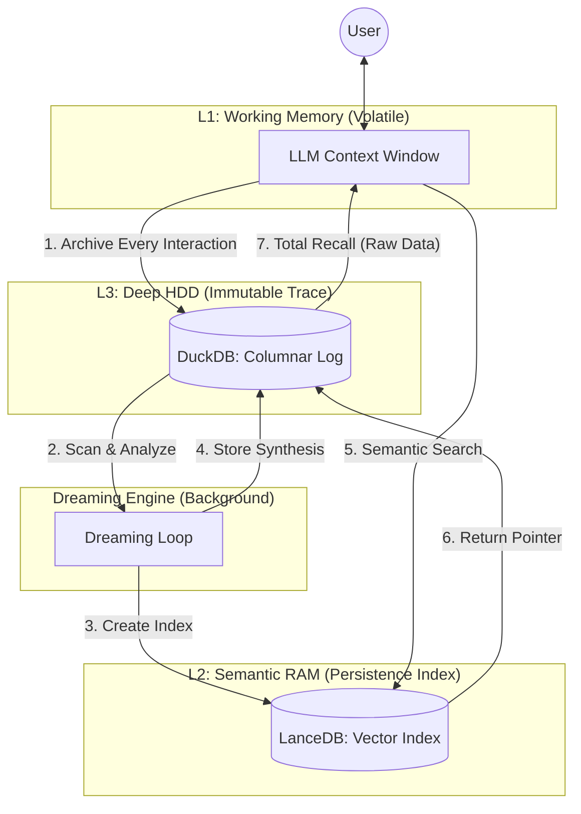
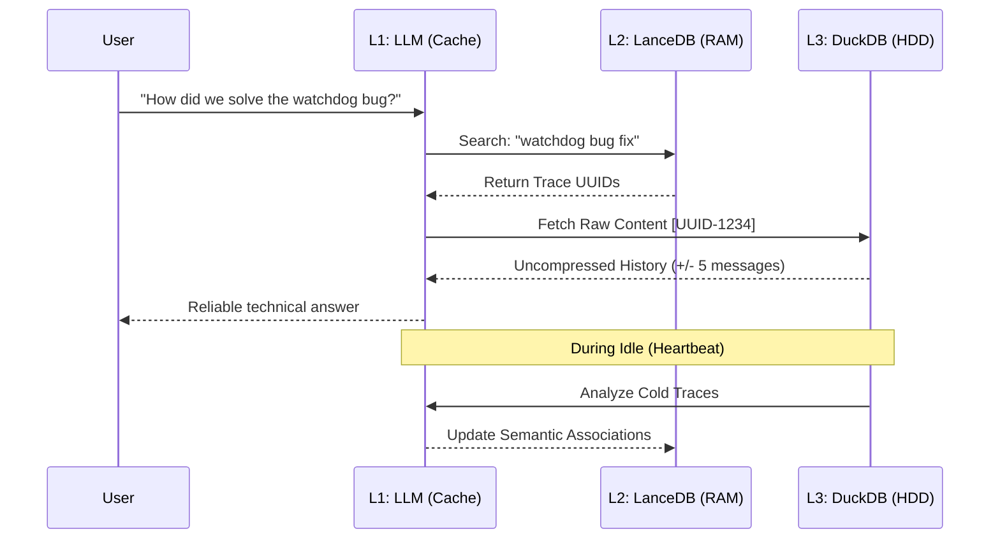

# RFC-0001: Biological-Inspired Tiered Memory Architecture (Dreamer Core)

*   **Status**: Proposed
*   **Author**: Antigravity & User
*   **Created**: 2026-02-12
*   **Scope**: Core Cognitive Infrastructure

## 1. Abstract
This RFC proposes a shift from lossy context compression to a 3-tier hierarchical storage model (Cache/RAM/HDD) inspired by computer architecture and human brain memory consolidation. It introduces the "Dreamer Core" mechanism for proactive background re-indexing and analytical insight generation.

## 2. Motivation
Existing Agent frameworks often handle context overflow by summarizing or truncating message history. This leads to:
- **Semantic Drift**: Loss of precise technical details over long sessions.
- **Context Blindness**: Inability to correlate disparate events across large time scales.
- **Fixed Intelligence**: Agents only "learn" during active inference, missing background consolidation opportunities.

## 3. High-Level Design (The 3-Tier Model)

Mirai avoids compression by **indexing** and **paging** raw data.

| Tier | Component | Technology | Goal |
| :--- | :--- | :--- | :--- |
| **L1 (Cache)** | LLM Window | Anthropic Claude | **Volatile Working Memory**. The immediate turn-by-turn dialogue. |
| **L2 (RAM)** | Vector Index | LanceDB (Columnar) | **Semantic Map**. High-speed lookup pointers to L3 records. |
| **L3 (HDD)** | Columnar Log | DuckDB | **The Digital Soul**. 100% raw, immutable trace of every interaction. |

---

## 4. Architecture Diagram

---

## 5. The Dreaming Cycle (Consolidation)
"Dreaming" is a background Heartbeat process that performs:
1.  **Memory Formation**: Scanning new L3 raw traces and generating semantic indices in L2.
2.  **Cross-Linking**: Identifying logical links between isolated events (e.g., matching a bug report to an old PR).
3.  **Analytic Reflection**: Running DuckDB queries to synthesize high-level patterns from months of activity.

---

## 6. Data Flow Sequence

## 7. Retrieval Protocol (Total Recall)
Instead of fuzzy summaries, Mirai uses a **Search-and-Inject** pattern:
1.  Semantic search in L2 returns a UUID.
2.  L3 (DuckDB) fetches the **raw source** and surrounding temporal context (+/- N messages).
3.  The uncompressed truth is injected into the L1 context window.

## 8. Trade-offs & Alternatives
- **SQLite vs. DuckDB for L3**: SQLite is row-based (OLTP). DuckDB is columnar (OLAP). Given that Dreaming requires heavy scans, DuckDB's performance and compression for time-series logs are superior.
- **Complexity**: This adds database management overhead but ensures "Digital Eternity"—the Agent's life experience is preserved in a portable, queryable format.

## 9. Future Work
- Implementation of "Decaying Importance" based on consolidated dreaming.
- Multi-agent shared L3 archives with private L2 semantic maps.
