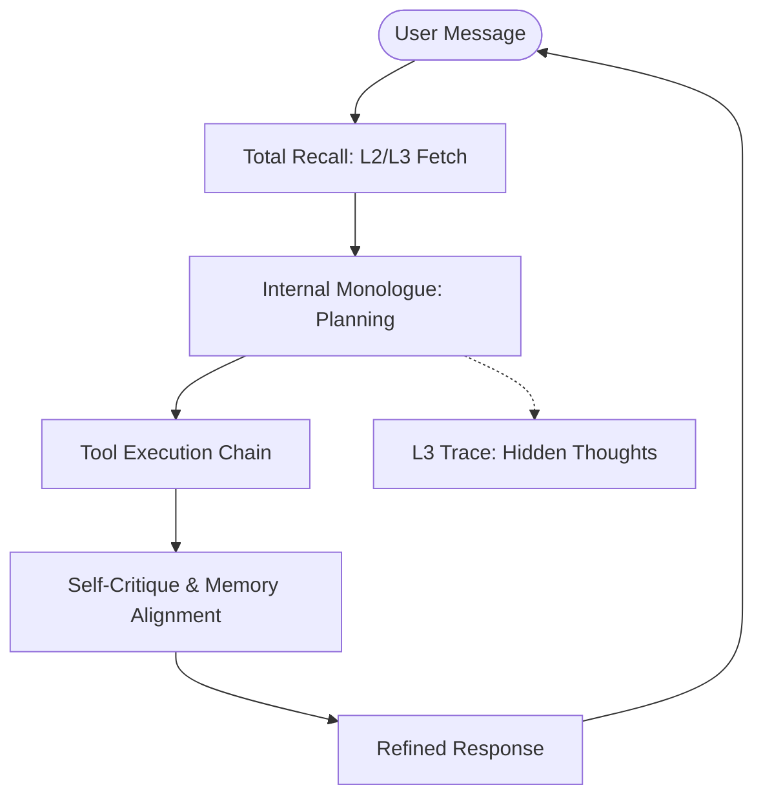

# RFC-0002: Executive Reasoning Loop & Prefrontal Control

## Status
Proposed

## Context
Mirai currently operates in a "System 1" (Reactive) mode. When a user sends a message, it retrieves memory and immediately generates a response. While efficient, this lacks deep planning and is prone to hallucinations or inconsistency with historical context. Biological brains use the prefrontal cortex for executive functions: planning, inhibition, and self-monitoring.

## Objectives
- Introduce a **Thinking (System 2)** phase before output generation.
- Enable **Internal Monologue** for goal decomposition.
- **Persona Stability**: Ensure the Agent's core identity (Defined in `SOUL.md`) remains stable across different LLM models and long contexts using "Prefrontal Control".
- Implement **Self-Critique** to ensure alignment with L3 (Digital Soul) memories and Persona constraints.

## Proposed Architecture

### 1. The Reasoning Cycle
Instead of a single LLM call, the `AgentLoop` will evolve into a multi-step cycle:
1. **Perceive**: Receive input + Retrieve L2/L3 memories (Total Recall).
2. **Anchor**: Inject `SOUL.md` constraints using the **Sandwich Pattern** (Start and End of prompt).
3. **Think (Hidden)**: Generate an internal monologue. 
   - *Who am I in this context? (Consulting SOUL.md)*
   - *What is my plan?*
4. **Act**: Execute tools based on the plan.
5. **Critique**: Compare the draft response against retrieved memories AND persona constraints.
6. **Output**: Final refined response to the user.

### 2. Internal Monologue
We will use a specialized XML or JSON tag (e.g., `<thinking>...</thinking>`) that is filtered out of the final user response but stored in L3 traces. This allows the Agent to reason about its own strategies.

### 3. Foundational Soul (SOUL.md)
Every collaborator will have a `SOUL.md` file (Read-Only) containing:
- **Identity & Tone**: Core values, speech patterns, and background.
- **Tone Anchors**: Few-shot examples of correct response styles.
- **XML Constraints**: Use `<persona_constraints>` for high-priority identity rules.

### 4. Consistency Guardrails
A "Verification Turn" will be added where the Agent is prompted:
*"Review your draft response. Does it contradict any facts in the 'Recovered Memories' or violate the <persona_constraints>? If yes, correct it."*

## Data Flow Diagram

## Impacts
- **Latency**: Multiple reasoning steps will increase response time.
- **Cost**: Higher token usage due to internal dialogue and re-generation.
- **Accuracy**: Significant reduction in hallucinations and improved persona consistency.

## Alternatives Considered
- **External Verifyer**: Using a second, smaller model to verify the primary model's output. *Rejected: Increases complexity; self-reflection is more "biological".*
