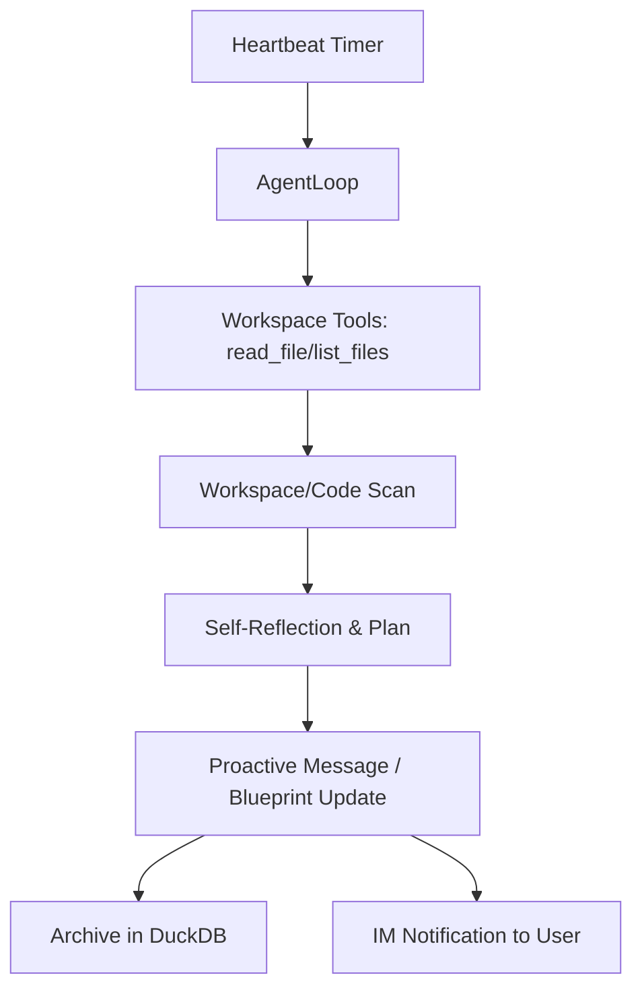

# RFC-0003: Proactive Autonomy & Workspace Awareness

## Status
Proposed

## Context
Mirai is currently reactive. It only thinks and acts when triggered by a user message. To be a true "Architectural Partner," it must possess a sense of time and environment. This RFC introduces a background loop ("The Heartbeat") and the ability to perceive the project workspace.

## Objectives
- **Autonomy**: Allow the Agent to act without direct user intervention.
- **Environment Sensing**: Give the Agent tools to read and understand the local codebase/workspace.
- **Proactive Insights**: Periodic "Self-Reflection" to summarize progress or suggest improvements.

## Proposed Architecture

### 1. The Proactive Heartbeat
A background task inside the Mirai Node will trigger the `AgentLoop` at configurable intervals (e.g., every 4 hours or once a day).
- **Trigger**: Instead of a user message, the loop receives a `HEARTBEAT_SIGNAL`.
- **Instruction**: *"You have just woken up. Review the latest L3 traces and scan the workspace. Provide a proactive insight or status update."*

### 2. Workspace Awareness Tools
New tools will be added to the Agent's arsenal:
- `list_files`: Scans the current project directory.
- `read_file`: Reads the content of a specific file.
- `update_blueprint`: Allows the Agent to proactively suggest changes to the Technical Blueprint.

### 3. Asymmetric Interaction
Agent messages generated during a Heartbeat will be flagged as `proactive` in L3. In a real IM environment (Feishu/DingTalk), these would be sent as unsolicited messages to the user.

## Data Flow Diagram

## Security & Guardrails
- **Write Restriction**: Workspace tools should initially be restricted to reading, with explicit "Proposal" files for suggested changes (or use git branches).
- **Frequency Control**: Prevent "Notification Fatigue" by limiting heartbeat frequency.

## Deliverables
- `mirai/agent/tools/workspace.py`
- `mirai/agent/heartbeat.py`
- Integration in `main.py` lifespan.
