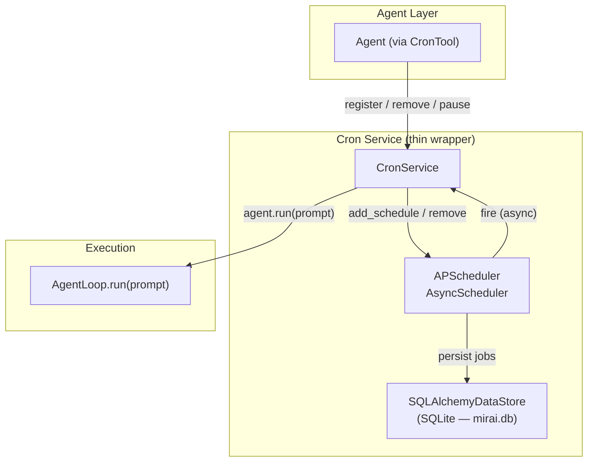

# ~~Cron Service: Agent-Driven Task Scheduling~~ (SUPERSEDED)

> [!CAUTION]
> **This RFC has been superseded by [RFC 0005: Cron Service — JSON5 + Git](0005-cron-json5-git.md).**
> RFC 0005 replaces APScheduler with a lightweight self-written scheduler using JSON5 file persistence and Git audit trail, better aligned with Mirai's Git-centric architecture.

> ~~Dynamic job registration for autonomous agent workflows, powered by APScheduler.~~

## Problem Statement

Mirai agents need the ability to schedule future work: periodic checks, delayed follow-ups, plan-driven re-entry, and self-maintenance cycles. Without a cron service, agents can only react to external messages — they cannot proactively initiate work.

The cron service is a foundational building block for the [Plan Engine](plan-engine.md): the Architect Agent needs it to schedule periodic reviews, retry failed steps, and keep the orchestrator loop alive across process restarts.

## Design Goals

| Goal | Rationale |
|------|-----------|
| **Agent-registerable** | Agents create, modify, and remove jobs at runtime via a tool call |
| **Persistent** | Jobs survive process restarts — stored in SQLite via APScheduler |
| **Missed-job recovery** | APScheduler natively fires missed jobs on startup if configured |
| **Non-blocking** | Async scheduler runs jobs without blocking the event loop |
| **Observable** | Job status, schedules, and next-fire times are queryable |

---

## Why APScheduler

| | APScheduler | croniter + custom | Celery |
|-|-------------|-------------------|--------|
| **GitHub Stars** | 7.3k | 519 | 24k |
| **Scope** | Full scheduler | Expression parser only | Distributed task queue |
| **Persistence** | Built-in (SQLite, PostgreSQL, MongoDB) | Manual (DuckDB CRUD) | Requires Redis/RabbitMQ |
| **Async** | Native asyncio (v4.x) | N/A | Limited |
| **Cron trigger** | Built-in | Built-in | Via celery-beat |
| **Concurrency control** | Built-in (`max_running_jobs`) | Manual | Built-in |
| **Missed job handling** | Built-in (`misfire_grace_time`) | Manual | Manual |
| **Dependencies** | Light (~200KB) | Lighter (~50KB) | Heavy |

APScheduler eliminates the need to write: tick loop, next-run calculation, persistence CRUD, missed-job recovery, and reentrance guards. We only write the thin integration layer (`CronTool`).

---

## Architecture



### Key Insight

APScheduler owns the scheduling loop, persistence, and job execution. `CronService` is a **thin adapter** that:
1. Translates agent tool calls into APScheduler API calls
2. Wraps the job callback to call `AgentLoop.run(prompt)`

---

## CronService Design

### System Jobs vs Agent Jobs

Jobs are categorized into two tiers with different access controls:

| Tier | Prefix | Created By | Agent CRUD? | Examples |
|------|--------|-----------|-------------|----------|
| **System** | `sys:` | Bootstrap code | ❌ Read-only via tool | `sys:heartbeat`, `sys:registry-refresh` |
| **Agent** | `agent:{collaborator_id}:` | Agent tool call | ✅ Full CRUD | `agent:mira:plan-abc-heartbeat` |

System jobs are registered during bootstrap and cannot be removed or paused by agent tool calls. This prevents an agent from accidentally deleting framework-level periodic tasks.

### CronContext

Cron-triggered jobs have no originating user or group. A dedicated `CronContext` provides the necessary metadata:

```python
@dataclass
class CronContext:
    """Context for cron-triggered agent runs (no user/group origin)."""
    source: str = "cron"
    job_name: str = ""
    reply_to: str | None = None    # chat_id, or None for curator default
    silent: bool = False           # if True, log only, no IM reply
```

### CronService

```python
class CronService:
    """Thin wrapper around APScheduler's AsyncScheduler.
    
    Provides:
    - Agent-friendly API (register/remove/list by name)
    - Job callback that injects prompts into AgentLoop
    - System vs agent job separation
    - Progressive error handling (warn → pause)
    - Lifecycle management (start/stop with MiraiApp)
    """
    
    SYSTEM_PREFIX = "sys:"
    AGENT_PREFIX = "agent:"
    MAX_CONSECUTIVE_FAILURES = 5
    WARN_THRESHOLD = 3
    
    def __init__(self, agent: AgentLoop, db_url: str = "sqlite:///mirai.db"):
        self.agent = agent
        self.data_store = SQLAlchemyDataStore(url=db_url)
        self.scheduler = AsyncScheduler(data_store=self.data_store)
        self._failure_counts: dict[str, int] = {}  # job_id → consecutive failures
    
    async def start(self):
        """Start the scheduler. Called from MiraiApp bootstrap."""
        await self.scheduler.start_in_background()
    
    async def stop(self):
        """Graceful shutdown."""
        await self.scheduler.stop()
    
    # --- System job API (used by bootstrap, not exposed to agent tool) ---
    
    async def register_system(
        self, name: str, schedule: str, prompt: str,
        reply_to: str | None = None,
    ) -> str:
        """Register a system-level job. Cannot be modified by agents."""
        job_id = f"{self.SYSTEM_PREFIX}{name}"
        return await self._register(job_id, schedule, prompt, reply_to)
    
    # --- Agent job API (exposed via CronTool) ---
    
    async def register(
        self, collaborator_id: str, name: str, schedule: str, prompt: str,
        reply_to: str | None = None,
    ) -> str:
        """Register an agent-level job. Namespaced by collaborator."""
        job_id = f"{self.AGENT_PREFIX}{collaborator_id}:{name}"
        return await self._register(job_id, schedule, prompt, reply_to)
    
    async def remove(self, collaborator_id: str, name: str):
        """Remove an agent job. Refuses to remove system jobs."""
        job_id = f"{self.AGENT_PREFIX}{collaborator_id}:{name}"
        await self.scheduler.remove_schedule(job_id)
    
    async def list_jobs(self, collaborator_id: str | None = None):
        """List schedules, optionally filtered by collaborator."""
        schedules = await self.scheduler.get_schedules()
        if collaborator_id:
            prefix = f"{self.AGENT_PREFIX}{collaborator_id}:"
            schedules = [s for s in schedules if s.id.startswith(prefix)]
        return schedules
    
    async def pause(self, collaborator_id: str, name: str):
        """Pause an agent schedule."""
        job_id = f"{self.AGENT_PREFIX}{collaborator_id}:{name}"
        await self.scheduler.pause_schedule(job_id)
    
    async def resume(self, collaborator_id: str, name: str):
        """Resume a paused agent schedule."""
        job_id = f"{self.AGENT_PREFIX}{collaborator_id}:{name}"
        await self.scheduler.unpause_schedule(job_id)
    
    # --- Internal ---
    
    async def _register(
        self, job_id: str, schedule: str, prompt: str,
        reply_to: str | None = None,
    ) -> str:
        trigger = self._parse_trigger(schedule)
        schedule_id = await self.scheduler.add_schedule(
            self._fire_job,
            trigger=trigger,
            id=job_id,
            kwargs={"job_id": job_id, "prompt": prompt, "reply_to": reply_to},
            max_running_jobs=1,
            misfire_grace_time=3600,
        )
        return schedule_id
    
    async def _fire_job(self, job_id: str, prompt: str, reply_to: str | None):
        """Callback invoked by APScheduler when a job is due."""
        context = CronContext(
            job_name=job_id,
            reply_to=reply_to,
            silent=(reply_to == "silent"),
        )
        try:
            await self.agent.run(prompt, context=context)
            self._failure_counts.pop(job_id, None)  # reset on success
        except Exception as exc:
            count = self._failure_counts.get(job_id, 0) + 1
            self._failure_counts[job_id] = count
            log.warning("cron_job_failed", job_id=job_id, attempt=count, error=str(exc))
            if count >= self.WARN_THRESHOLD:
                await self._notify_curator(
                    f"⚠️ Cron job `{job_id}` failed {count} times consecutively."
                )
            if count >= self.MAX_CONSECUTIVE_FAILURES:
                log.error("cron_job_auto_paused", job_id=job_id)
                await self.scheduler.pause_schedule(job_id)
                await self._notify_curator(
                    f"🛑 Cron job `{job_id}` auto-paused after {count} consecutive failures."
                )
    
    def _parse_trigger(self, schedule: str):
        """Parse schedule string into APScheduler trigger."""
        if schedule.startswith("@every "):
            # "@every 5m" → IntervalTrigger
            return IntervalTrigger(...)
        elif schedule.startswith("@once "):
            # "@once 2026-02-15T10:00" → DateTrigger
            return DateTrigger(...)
        else:
            # Standard cron: "*/5 * * * *" → CronTrigger
            return CronTrigger.from_crontab(schedule)
```

### What We DON'T Need to Write

| Feature | Status |
|---------|--------|
| Tick loop (`while True` + `sleep`) | ❌ APScheduler handles it |
| `next_run_at` calculation | ❌ APScheduler handles it |
| DuckDB CRUD for jobs | ❌ APScheduler persists to SQLite |
| Missed job recovery | ❌ `misfire_grace_time` handles it |
| Reentrance guard | ❌ `max_running_jobs=1` handles it |
| Crash recovery | ❌ SQLAlchemy data store auto-recovers |

---

## Data Persistence

APScheduler v4 uses its own data store abstraction. We use `SQLAlchemyDataStore` backed by the existing `mirai.db` (SQLite):

```
APScheduler creates and manages these tables automatically:
  - ap_schedules      — registered schedules (cron expression, trigger config)
  - ap_jobs           — pending job executions
  - ap_job_results    — completed job results
  - ap_metadata       — scheduler metadata
```

> [!NOTE]
> We reuse the existing `mirai.db` SQLite file (already initialized in `bootstrap._init_storage()`). No new database file needed. DuckDB remains for heavy analytics (traces, history); SQLite handles lightweight metadata (sessions, schedules).

---

## Schedule Expression Formats

Three syntaxes supported (parsed by `_parse_trigger()`):

### Standard Cron (5-field)

```
┌───── minute (0-59)
│ ┌───── hour (0-23)
│ │ ┌───── day of month (1-31)
│ │ │ ┌───── month (1-12)
│ │ │ │ ┌───── day of week (0-6, Mon=0)
│ │ │ │ │
* * * * *
```

| Expression | Meaning |
|-----------|---------|
| `*/5 * * * *` | Every 5 minutes |
| `0 9 * * 1-5` | 9:00 AM weekdays |
| `0 */2 * * *` | Every 2 hours |

### Simple Interval (`@every`)

| Expression | APScheduler Trigger |
|-----------|---------------------|
| `@every 30s` | `IntervalTrigger(seconds=30)` |
| `@every 5m` | `IntervalTrigger(minutes=5)` |
| `@every 2h` | `IntervalTrigger(hours=2)` |

### One-time (`@once`)

| Expression | APScheduler Trigger |
|-----------|---------------------|
| `@once 2026-02-15T14:00:00` | `DateTrigger(run_date=...)` |

---

## CronTool — Agent Interface

A `BaseTool` subclass exposing the scheduler to the agent:

### Tool Definition

```yaml
name: cron
description: Manage scheduled tasks that fire prompts on a schedule.

parameters:
  action: enum [register, list, remove, pause, resume]
  
  # register:
  name: string      — unique job name
  schedule: string   — cron expression, @every interval, or @once datetime
  prompt: string     — prompt injected into agent when fired
  
  # remove / pause / resume:
  name: string       — job name to operate on
```

### Agent Usage Examples

```json
// Register a periodic check with output routed to a specific chat
{"action": "register", "name": "health-check", "schedule": "*/30 * * * *",
 "prompt": "Run system diagnostics and report anomalies.",
 "reply_to": "oc_abc123"}

// Register a plan heartbeat (Plan Engine integration)
{"action": "register", "name": "plan-abc-heartbeat", "schedule": "@every 1m",
 "prompt": "Check plan abc progress. Execute next pending step if any."}

// Register a silent job (log only, no IM reply)
{"action": "register", "name": "db-cleanup", "schedule": "0 3 * * *",
 "prompt": "Clean up expired sessions from the database.",
 "reply_to": "silent"}

// List all jobs
{"action": "list"}

// Remove a completed plan's heartbeat
{"action": "remove", "name": "plan-abc-heartbeat"}
```

---

## Integration Points

### With Plan Engine

The Architect Agent uses cron to drive the plan loop without writing Python:

```
Architect → cron.register("plan-heartbeat", "@every 1m", "Execute next plan step")
  → APScheduler fires every minute
    → agent.run("Execute next plan step")
      → Agent reads plan DB, does work, updates progress
        → Plan complete? → Agent calls cron.remove("plan-heartbeat")
```

### With Bootstrap Lifecycle

```python
# MiraiApp._init_background_tasks():
self.cron_service = CronService(agent=self.agent, db_url=config.database.sqlite_url)
await self.cron_service.start()

# MiraiApp.shutdown():
await self.cron_service.stop()
```

### Subsume Existing Periodic Services

Existing periodic tasks can be migrated to **system jobs** (protected from agent CRUD):

| Current Service | System Job Replacement |
|----------------|------------------------|
| `HeartbeatManager` (60s tick) | `cron.register_system("heartbeat", "@every 60s", ...)` |
| `AgentDreamer` (1h tick) | `cron.register_system("dream-cycle", "@every 1h", ...)` |
| `registry_refresh_loop` (5m tick) | `cron.register_system("registry-refresh", "@every 5m", ...)` |
| `_health_check_loop` (10m tick) | `cron.register_system("health-check", "@every 10m", ...)` |

Migration is optional but unifies all periodic work under one observable system. System jobs appear in `list` output but cannot be removed/paused via the agent tool.

---

## File Layout

```
mirai/
├── cron.py                      # CronService (thin APScheduler wrapper)
├── agent/tools/
│   └── cron_tool.py             # CronTool (BaseTool subclass)
└── bootstrap.py                 # + CronService init/start/stop
```

Compared to the croniter approach, we eliminated:
- ❌ `CronScheduler(BaseBackgroundService)` — APScheduler has its own loop
- ❌ DuckDB `cron_jobs` table + 6 CRUD methods — APScheduler manages persistence
- ❌ `CronJob` Pydantic model — APScheduler has its own `Schedule` model

---

## Dependency

```toml
# pyproject.toml
"apscheduler==4.0.0a5"          # Pin to specific alpha for API stability
"sqlalchemy>=2.0"                # Already a transitive dependency via sqlmodel
```

> [!NOTE]
> APScheduler v4 is alpha but actively developed since 2023. We pin to a specific version to avoid API breakage. Upgrade manually with regression testing.

---

## Resolved Design Decisions

### 1. APScheduler v3 vs v4 → **v4**

Mirai is async-first. v4's native `AsyncScheduler` and `SQLAlchemyDataStore` align directly. v3's `AsyncIOScheduler` wraps a synchronous core — unnecessary complexity.

### 2. Job output routing → **Per-job `reply_to` with curator fallback**

Each job can specify a `reply_to` target:
- `reply_to=None` → send to curator's default channel
- `reply_to="oc_abc123"` → send to specific chat
- `reply_to="silent"` → log only, no IM delivery

Implemented via `CronContext.reply_to` (see CronService design above).

### 3. Error handling → **Progressive: warn at 3, pause at 5**

| Consecutive Failures | Action |
|---------------------|--------|
| 1–2 | Log warning |
| 3–4 | Log warning + notify curator via IM |
| ≥5 | Auto-pause job + notify curator |

Paused jobs can be resumed by the agent (`cron resume`) or by a human restarting the process.

---

## Concurrency Notes (AB Dual-Node)

> [!WARNING]
> SQLite does not support concurrent writes from multiple processes. In an AB dual-node deployment, both nodes cannot share the same `mirai.db` for APScheduler.
>
> **Mitigation options:**
> - (A) Only the active node runs the scheduler; standby node skips `cron_service.start()`
> - (B) Use PostgreSQL-backed `SQLAlchemyDataStore` instead of SQLite for shared state
>
> For MVP (single-node), SQLite is sufficient. Revisit when AB self-healing is implemented.
