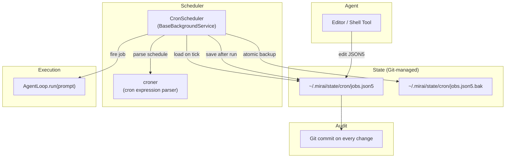

# RFC 0005: Cron Service — JSON5 + Git State Management

> Lightweight agent-driven task scheduling with file-based persistence and Git audit trail.
>
> **Supersedes** [RFC 0004](0004-cron-service.md) (APScheduler approach). See [design comparison](#why-self-written-scheduler-not-apscheduler).

## Summary

A cron scheduling service that allows agents to register, modify, and remove periodic tasks at runtime. Jobs are persisted as a **JSON5 file** managed by **Git**, enabling:
- Agent self-service via existing editor/shell tools (no dedicated CronTool needed)
- Human-readable state that can be hand-edited and commented
- Full audit trail via Git history
- Easy recovery from corruption (git revert / restore `.bak`)

This design follows OpenClaw's proven approach (`~/.openclaw/cron/jobs.json`) adapted for Mirai's Git-centric architecture.

---

## Design Decisions

### Why JSON5 File (not Database)

| Concern | JSON5 File | SQLite / DuckDB |
|---------|-----------|-----------------|
| Agent editable | ✅ editor/shell tool | ❌ needs SQL or dedicated tool |
| Human debuggable | ✅ `cat jobs.json5` | ❌ binary file |
| Commentable | ✅ `// daily report for curator` | ❌ |
| Git versionable | ✅ text diff, blame, revert | ❌ binary blob |
| Corruption recovery | ✅ delete file or `git checkout` | ⚠️ DB rebuild |
| Scale limit | ~hundreds of jobs | unlimited |

For Mirai's scale (tens of jobs per agent), JSON5 is sufficient and far more agent-friendly.

### Why Self-Written Scheduler (not APScheduler)

APScheduler's `DataStore` abstraction expects SQL-level transactional semantics. Fitting JSON5 into it would be more complex than writing a simple scheduler from scratch. OpenClaw proves this approach works in production with ~150 lines of scheduler code.

---

## Architecture



---

## Job Tiers: System vs Agent

Jobs are split into two files with different access controls:

| Tier | File | Created By | Agent Editable? | Examples |
|------|------|-----------|----------------|----------|
| **System** | `cron/system.json5` | Bootstrap code | ❌ Read-only | `registry-refresh`, `health-check` |
| **Agent** | `cron/jobs.json5` | Agent (editor/shell) | ✅ Full CRUD | `daily-report`, `plan-heartbeat` |

The scheduler loads **both files** on each tick but only allows agents to modify `jobs.json5`. System jobs cannot be disabled or deleted by agents, preventing accidental removal of framework-level tasks.

---

## File Format: `cron/system.json5`

```json5
{
  // System-level jobs — DO NOT EDIT (managed by bootstrap)
  version: 1,
  jobs: [
    {
      id: "sys:registry-refresh",
      name: "registry-refresh",
      enabled: true,
      schedule: { kind: "every", everyMs: 300000 },       // 5 minutes
      payload: {
        kind: "agentTurn",
        prompt: "Refresh model registry from all sources.",
      },
      state: {},
    },
    {
      id: "sys:health-check",
      name: "health-check",
      enabled: true,
      schedule: { kind: "every", everyMs: 600000 },       // 10 minutes
      payload: {
        kind: "agentTurn",
        prompt: "Probe all configured free provider health.",
      },
      state: {},
    },
  ],
}
```

## File Format: `cron/jobs.json5`

```json5
{
  version: 1,
  jobs: [
    {
      // Daily standup report for curator
      id: "01JQXYZ",
      name: "daily-report",
      enabled: true,
      schedule: { kind: "cron", expr: "0 9 * * 1-5", tz: "Asia/Shanghai" },
      payload: {
        kind: "agentTurn",
        prompt: "Generate daily progress report and send to curator.",
      },
      delivery: { channel: "feishu", to: "curator" },
      state: {
        nextRunAtMs: 1739520000000,
        lastRunAtMs: 1739433600000,
        lastStatus: "ok",
        runCount: 47,
        consecutiveErrors: 0,
      },
    },
    {
      // Plan heartbeat — auto-registered by Architect Agent
      id: "01JQABC",
      name: "plan-heartbeat-gcc-rewrite",
      enabled: true,
      schedule: { kind: "every", everyMs: 60000 },          // every 1 minute
      payload: {
        kind: "agentTurn",
        prompt: "Check plan gcc-rewrite progress. Execute next pending step.",
      },
      state: {
        nextRunAtMs: 1739520060000,
        lastRunAtMs: 1739520000000,
        lastStatus: "ok",
        runCount: 812,
      },
    },
    {
      // One-time reminder — auto-deletes after firing
      id: "01JQDEF",
      name: "deploy-reminder",
      enabled: true,
      deleteAfterRun: true,
      schedule: { kind: "at", at: "2026-02-15T14:00:00+08:00" },
      payload: {
        kind: "agentTurn",
        prompt: "Reminder: deploy v2.1.0 to staging now.",
      },
      delivery: { channel: "silent" },  // log only, no IM reply
      state: {},
    },
  ],
}
```

---

## Data Model

### Schedule Types

```typescript
// Three kinds of schedule triggers
type CronSchedule =
  | { kind: "cron"; expr: string; tz?: string }    // "0 9 * * 1-5"
  | { kind: "every"; everyMs: number }              // interval in ms
  | { kind: "at"; at: string }                      // ISO 8601 one-shot
```

### Job State (managed by scheduler code, not by agent)

```typescript
type CronJobState = {
  nextRunAtMs?: number;       // pre-computed next fire time
  lastRunAtMs?: number;
  lastStatus?: "ok" | "error" | "skipped";
  lastError?: string;
  runCount?: number;
  consecutiveErrors?: number; // auto-pause after threshold
}
```

### Full Job Structure

```typescript
type CronJob = {
  id: string;                 // ULID (agent jobs) or "sys:name" (system jobs)
  name: string;               // human-readable unique key
  enabled: boolean;
  deleteAfterRun?: boolean;   // one-shot jobs
  schedule: CronSchedule;
  payload: {
    kind: "agentTurn";
    prompt: string;           // injected into agent.run()
    model?: string;           // optional model override
    timeoutSeconds?: number;
  };
  delivery?: {
    channel?: string;         // "feishu" | "silent"
    to?: string;              // chat_id or "curator" (default)
  };
  state: CronJobState;
}
```

---

## Scheduler Design

### CronScheduler (extends BaseBackgroundService)

Tick interval: **15 seconds**. Each tick:

```
1. Check file mtime — if changed externally, reload from disk
   (loads both system.json5 and jobs.json5)
2. Find due jobs: state.nextRunAtMs <= Date.now() AND enabled
3. For each due job:
   a. Skip if already running (reentrance guard)
   b. Spawn asyncio.Task → agent.run(job.payload.prompt)
   c. Update state: lastRunAtMs, nextRunAtMs, runCount, lastStatus
   d. If deleteAfterRun → remove from jobs array
   e. Progressive error handling:
      - consecutiveErrors >= 3 → notify curator via IM
      - consecutiveErrors >= 5 → auto-disable job, notify curator
4. Persist to disk (atomic write + .bak backup)
5. Git commit if any state changed (batch: one commit per tick, not per job)
```

### Atomic Write (from OpenClaw)

```python
async def save(store: CronStore, path: str):
    tmp = f"{path}.{os.getpid()}.{random_hex()}.tmp"
    data = json5.dumps(store, indent=2)
    await aiofiles.write(tmp, data)
    os.rename(tmp, path)                     # atomic on POSIX
    shutil.copy2(path, f"{path}.bak")        # best-effort backup
```

### External Edit Detection

```python
async def tick(self):
    current_mtime = os.stat(self.store_path).st_mtime
    if current_mtime != self._last_mtime:
        self.store = await load_from_disk()  # agent or human edited the file
        self._last_mtime = current_mtime
```

This enables agents to edit `jobs.json5` directly with editor tools — the scheduler picks up changes on the next tick.

### Startup Recovery

```
On init:
  1. Load jobs.json5 (or create empty if missing)
  2. For each enabled job:
     - nextRunAtMs < now - 1 hour  → skip, advance to next future time
     - nextRunAtMs < now           → fire immediately (missed recovery)
     - nextRunAtMs >= now          → normal, wait
  3. Recompute all nextRunAtMs
  4. Persist
```

### Cron Expression Parsing

Use `croner` (PyPI: `croner-py`) or implement minimal cron parsing. OpenClaw uses the npm package `croner` (1.3k stars). For Python, options:

| Library | Approach |
|---------|----------|
| `croniter` (519★) | Pure Python, good enough for next-fire calculation |
| Self-written | ~50 lines for 5-field cron → next datetime |
| `croner-py` | If available, mirrors OpenClaw's choice |

For `@every` and `@at` triggers, no library needed — pure arithmetic.

---

## Git Integration

### State Directory Layout

```
~/.mirai/state/                     ← Git repository
├── .git/
├── cron/
│   ├── system.json5                ← system jobs (bootstrap-managed)
│   ├── jobs.json5                  ← agent jobs (agent-editable)
│   └── jobs.json5.bak
├── plans/                          ← (future) Plan Engine state
│   └── plan-gcc-rewrite.json5
├── soul/
│   └── SOUL.md                     ← agent personality
└── config/
    └── runtime.json5               ← runtime overrides
```

### Commit Protocol

After every state mutation:

```python
async def git_commit_state(message: str):
    await run("git", "-C", STATE_DIR, "add", "-A")
    await run("git", "-C", STATE_DIR, "commit", "-m", message, "--allow-empty")
```

Commit messages are structured:

```
cron: added job "daily-report" (*/5 * * * *)
cron: job "health-check" fired (run #47, ok)
cron: job "health-check" auto-paused (5 consecutive errors)
cron: job "deploy-reminder" deleted (one-shot completed)
```

### Recovery via Git

```bash
# See what changed
git -C ~/.mirai/state log --oneline cron/

# Agent broke jobs.json5? Revert last change
git -C ~/.mirai/state checkout HEAD~1 -- cron/jobs.json5

# See who added a suspicious job
git -C ~/.mirai/state blame cron/jobs.json5
```

---

## Agent Interaction

### No Dedicated CronTool Required

Agents use **existing tools** to manage cron jobs:

```
Agent wants to add a cron job:
  → editor tool: insert new job object into jobs.json5
  → shell tool: git add + commit

Agent wants to list jobs:
  → shell tool: cat ~/.mirai/state/cron/jobs.json5

Agent wants to disable a job:
  → editor tool: set "enabled": false in jobs.json5

Agent wants to see job history:
  → shell tool: git log cron/jobs.json5
```

### Optional: CronTool for Convenience

A lightweight `CronTool` can be added later as syntactic sugar:

```json
{"action": "register", "name": "daily-report", "schedule": "0 9 * * *",
 "prompt": "Generate daily report."}
```

But this is optional — the system works without it.

---

## Integration with Plan Engine

The Plan Engine's Architect Agent uses cron to self-drive:

```
Architect creates a plan:
  1. Writes plan state to ~/.mirai/state/plans/plan-abc.json5
  2. Edits cron/jobs.json5 to add:
     { name: "plan-abc-heartbeat", schedule: { kind: "every", everyMs: 60000 },
       payload: { prompt: "Execute next step of plan-abc" } }
  3. git commit "plan: started plan-abc with cron heartbeat"

Each minute:
  CronScheduler fires → agent.run("Execute next step of plan-abc")
  → Agent reads plan state → does work → updates plan state → git commit

Plan completes:
  Agent removes heartbeat from jobs.json5
  → git commit "plan: completed plan-abc, removed heartbeat"
```

---

## Dependency

Minimal — only a cron expression parser. Options:
- `croniter>=2.0` (most proven, 2M monthly PyPI downloads)
- Or self-written (~50 lines)

No APScheduler, no new database, no heavy dependencies.

---

## Resolved Design Decisions

### 1. Git commit frequency → **Batch per tick**

One commit per scheduler tick (15s), not per individual job fire. This avoids Git noise while still providing fine-grained history. The commit message lists all jobs that fired in that tick:

```
cron: tick — fired daily-report (#48 ok), plan-heartbeat (#813 ok)
```

### 2. Job output routing → **Per-job `delivery` with curator fallback**

Each job can specify a `delivery` block:
- `delivery` absent or `to: "curator"` → send to curator's default channel
- `to: "oc_abc123"` → send to specific chat
- `channel: "silent"` → log only, no IM delivery

### 3. Max concurrent jobs → **Global cap of 3**

The scheduler limits concurrent job executions to 3. Additional due jobs are deferred to the next tick. This prevents resource exhaustion when many jobs fire simultaneously.

---

## Concurrency Notes (AB Dual-Node)

> [!WARNING]
> In an AB dual-node deployment, both nodes must not run distinct `CronScheduler` instances against the same `~/.mirai/state` Git repo concurrently — Git is not designed for concurrent writes.
>
> **Mitigation options:**
> - (A) Only the active node runs the scheduler; standby node skips `cron_scheduler.start()`
> - (B) Use a file lock (`flock`) on `jobs.json5` to serialize access
>
> For MVP (single-node), no action needed. Revisit when AB self-healing is implemented.
